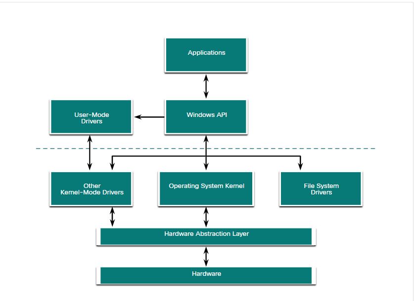

# Chapter 2

## PII 
A subset of PII is protected health information (PHI). The medical community creates and maintains electronic medical records (EMRs) that contain PHI. In the U.S., handling of PHI is regulated by the Health Insurance Portability and Accountability Act (HIPAA). In the European Union the General Data Protection Regulation (GDPR) protects a broad range of personal information in including health records.

Personal security information (PSI) is another type of PII. This information includes usernames, passwords, and other security-related information that individuals use to access information or services on the network. According to a 2019 report by Verizon, the second most common way that threat actors breached a network was by using stolen PSI.

# Chapter 3

## Tier 1 Alert Analyst – These professionals monitor incoming alerts, verify that a true incident has occurred, and forward tickets to Tier 2, if necessary.
Tier 2 Incident Responder- These professionals are responsible for deep investigation of incidents and advise remediation or action to be taken.
Tier 3 Threat Hunter – These professionals have expert-level skill in network, endpoint, threat intelligence, and malware reverse engineering. They are experts at tracing the processes of the malware to determine its impact and how it can be removed. They are also deeply involved in hunting for potential threats and implementing threat detection tools. Threat hunters search for cyber threats that are present in the network but have not yet been detected.
SOC Manager – This professional manages all the resources of the SOC and serves as the point of contact for the larger organization or customer.

## Windows

#### Hardware abstraction layer
Handle communication between the kernel and all the hardware

#### File Systems
NTFS is the most widely used file system for Windows for many reasons. NTFS supports very large files and partitions and it is very compatible with other operating systems. NTFS is also very reliable and supports recovery features. Most importantly, it supports many security features. Data access control is achieved through security descriptors. These security descriptors contain file ownership and permissions all the way down to the file level. NTFS also tracks many time stamps to track file activity. Sometimes referred to as MACE, the timestamps Modify, Access, Create, and Entry Modified are often used in forensic investigations to determine the history of a file or folder. NTFS also supports file system encryption to secure the entire storage media.

Before a storage device such as a disk can be used, it must be formatted with a file system. In turn, before a file system can be put into place on a storage device, the device needs to be partitioned. A hard drive is divided into areas called partitions. Each partition is a logical storage unit that can be formatted to store information, such as data files or applications. During the installation process, most operating systems automatically partition and format the available drive space with a file system such as NTFS.

NTFS formatting creates important structures on the disk for file storage, and tables for recording the locations of files:

Partition Boot Sector - This is the first 16 sectors of the drive. It contains the location of the Master File Table (MFT). The last 16 sectors contain a copy of the boot sector.
Master File Table (MFT) - This table contains the locations of all the files and directories on the partition, including file attributes such as security information and timestamps.
System Files - These are hidden files that store information about other volumes and file attributes.
File Area - The main area of the partition where files and directories are stored.
Note: When formatting a partition, the previous data may still be recoverable because not all the data is completely removed. The free space can be examined, and files can be retrieved which can compromise security. It is recommended to perform a secure wipe on a drive that is being reused. The secure wipe will write data to the entire drive multiple times to ensure there is no remaining data.

#### Alternate Data stream

$DATA
is a data stream containing the attributes of a file etc
Textfile.txt:ADS

#### Windows boot

KMCS
Kernel mode code signing, make sure all drivers are appropriate

NTOS
Run kernel 

Load sms 
before loading screen

UEFI 
stores bootcode in firmware for more security

#### Registry
HKEY LOCAL MACHINE
HKEY CURRENT USER

Safer to use MSCONFIG

# Linux

Linux in SOC

#### Sguil
Network analyzer

#### Security Onion 
is an open source suite of tools that work together for network security analysis

#### Network packet capture

#### IDSs

#### Commands
iwconfig

#### Ports
Ftp 20/21
SSH 22
Telnet 23
SMTP 25
DNS 53
DHCP 67/68
TFTP 69
POP3 110
NTP 123
IMAP 143
SNMP 161/162

#### Logs file
Application
Events logs
Service
System

/var/log/messages
- This directory contains generic computer activity
logs
- It is mainly used to store informational and non-critical system messages

/var/log/auth.log
- This file stores all authentication-related events in debian and ubuntu computers
- Anything involving the user authorization mechanism can be found in this file

/var/log/secure
- This directory is used by redhat and centos computers
- It also tracks sudo logins, SSH logins and other errors logged by SSSD

/var/log/boot.log
- This file stores boot-related information and messages logged during the computer startup process

#### Hard vs Soft Link

# Network Protocols

Peer to peer: Many computers function as both the servers and clients on the network

SOHO: Small office and home office

An Internet eXchange Point (IXP) is a physical location through which Internet infrastructure companies such as Internet Service Providers (ISPs), CDNs, web enterprises, communication service providers, cloud and SaaS providers connect to exchange Internet traffic.

DHCPv4 Ipv4
DHCPv6
SLAAC - allows a device to obtain its ipv6 addressing information without using a dhcp v6 server

TFTP is connectionless, for small (Uses UDP)

OSPF - Link-state routing protocol design based on areas, distance vector

EIGRP - Cisco proprietary routing protocol that use composite metric based on bandwidth, delay, load and reliability

BGP - Open standard exterior gateway routing protocol between internet and ISPs

Unicast -> One to one means only single destination

Multicast -> When a host needs to send messages using a one to many delivery option

Broadcast -> If all hosts on the network need to receive the message at the same time, a broadcast, one to all

Segmenting -> Increase speed as small can be transmitted and increase efficiency as only a small can be retransmitted

Data - application layer
segement - transport
Packet - Network
Frame - Datalink
Bits - Physical layer