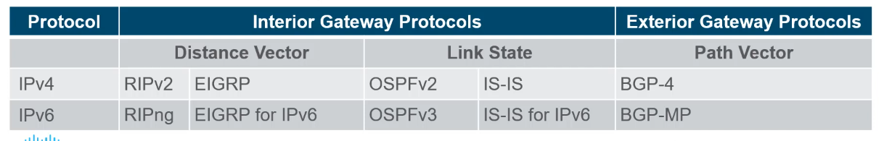
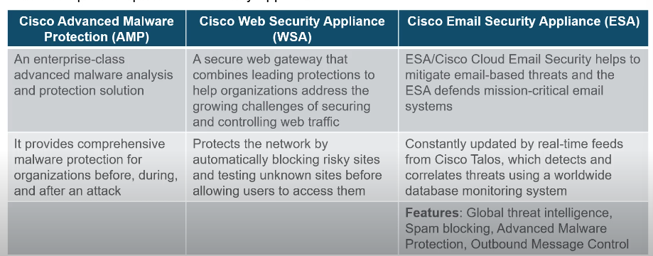
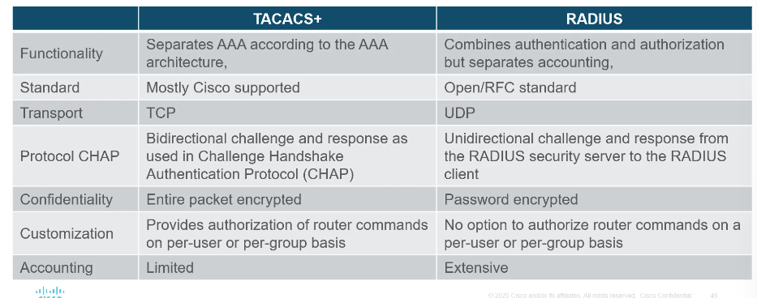

# Chapter 11-12

- ISIS and OSPF are link-state routing protocols. EIGRP and RIP are distance vector routing protocols. BGP is a path vector protocol.
- Routed ports on a Cisco switch behave similarly to those on a router. They are configured with an IP address and forward Layer 3 packets. Unlike Layer 2 switch interfaces, routed ports do not support STP, nor do they support subinterfaces as routers do.

- A wireless client operating in active mode must know the name of the SSID. Probe requests are broadcast by a client across multiple channels and include the SSID name and supported standards. Active mode is used if an AP is configured to not broadcast beacon frames.

- In passive mode, the wireless clients learn what networks and APs are available. The client learns this information from beacon frames, sent by the APs, that contain the WLAN SSID, supported standards, and security settings.

- An interface can belong to only one zone. Creating a zone is the first step in configuring a zone-based policy firewall. A zone cannot be assigned to an interface if the zone has not been created. Traffic can never flow between an interface that is assigned to a zone and an interface that has not been assigned to a zone.

- Zone-based policy firewalls (ZPFs) use the concept of zones to provide additional flexibility. A zone is a group of one or more interfaces that have similar functions or features. Zones help you specify where a Cisco IOS firewall rule or policy should be applied. In the figure, security policies for LAN 1 and LAN 2 are similar and can be grouped into a zone for firewall configurations. By default, the traffic between interfaces in the same zone is not subject to any policy and passes freely. However, all zone-to-zone traffic is blocked. In order to permit traffic between zones, a policy allowing or inspecting traffic must be configured.

The only exception to this default deny any policy is the router self zone. The self zone is the router itself and includes all the router interface IP addresses. Policy configurations that include the self zone would apply to traffic destined to and sourced from the router. By default, there is no policy for this type of traffic. Traffic that should be considered when designing a policy for the self zone includes management plane and control plane traffic, such as SSH, SNMP, and routing protocols.

- The Cisco Web Security Appliance is a secure web gateway which combines advanced malware protection, application visibility and control, acceptable use policy controls, reporting, and secure mobility functions. With traditional web security appliances, these functions are typically provided through multiple appliances. It is not a firewall appliance in that it only filters web traffic. It does not provide VPN connections, nor does it provide email virus and spam filtering; the Cisco Email Security Appliance provides these functions.
- URL filter and Web reporting

- TACACS+ uses TCP, encrypts the entire packet (not just the password), and separates authentication and authorization into two distinct processes. Both protocols are supported by the Cisco Secure ACS software.

- A VPN is a private network that is created over a public network. Instead of using dedicated physical connections, a VPN uses virtual connections routed through a public network between two network devices.

- SNMP is an application layer protocol that allows administrators to manage devices on the network by providing a messaging format for communication between network device managers and agents.

Hop count - distance
Link state - whether link is up/ how fast or slow

Hub - Repeater
Bridges - Two interfaces and are connected between hubs to divide the network into multiple collision domains. Each Domain can have only one sender at a time

STP
- Spanning tree protocol
- Maintain one loop-free path in the layer 2 network at any time

Multilayer switching
- Layer 3 switch
- Most expensive that can act as a router
- Switch virtual interface (SVI) virtual VLAN interface for inter-VLAN routing, virtual routed-vlan interface

Wireless communications
- 802.11 For wireless
- Define standards like AP 

802.11 Wireless LAN
- Radio Frequency
- Collision Avoidance

802.3 Wired Ethernet LAN
- Physical Cables
- Collision detection

FCS - Used for layer 2 error control

Listens to the channel to see if it is idle. The channel is also called the carrier

Sends a ready to send (RTS) message to the AP to request dedicated access to the network

Receives a Clear to Send (CTS) message from the AP granting access to send

If the wirelesss client does not receive CTS it waits a random amount of time before restarting the process

Wireless
1. Discover
2. Authenticate
3. Associate

SSID
Password
Network mode
Security Mode
Channel Settings

Active and Passive mode
Passive
-> AP openly advertise it servbice by sending broadcast data
Active is opposite

WLC (Wireless LAN controller)
- centralised all wireless devices

3 Layer network design model
- Access layer -> Provides endpoints and users direct access to the network
- Distribution -> Aggregates access layers and provides connectivity to servers
- Core - Provides connectivity between distribution layers for large LAN environments

Collapsed Core -> Distribution and Core combined

DMZ
- Inside interface connected to the private network
- Outside interface connected to public network
- DMZ interface

Zone-based Policy firewalls (ZPFs)
- ZPFs use the concept of zones to provide additional flexiblity
- A zone is a group of one or more interfaces that have similar functions or features
- Zones help to specify where a Cisco IOS fiewall rule or policy should be applied 

Firewall -> Access control list

Packet filtering (Stateless) Firewall
- Are part of a router firewall, which permits or denies traffic based on layer 3 and 4 information
- Use a simple policy table look-up that filters traffic based on specific criteria

Stateful firewall
- +Session layer
- Maintain state table

Application gateway firewall
- 3,4,5 and 7 layers
- Most of the firewall control and filtering is done in the software

Next-generation firewalls (NGFW)
- Go beyond stateful firewalls by providing
- Integrated intrusion prevention
- Application awareness and control to see and block risky apps
- Upgrade paths to include future information feeds
- Techniques to address evolving security threats

Transparent firewall, Filters IP traffice between a pair of bridged interfaces

Intrusion prevention
- Take action when something happens

Intrusion detection
- Alert when something happens

Host-based IPS (HIPS)

Network-based IPS

Cisco Advanced Malware Protection (AMP)

Cisco Web Security Applicance (WSA)

Cisco Email Security Appliance (ESA)

Standarded ACL, permits and deny based on Source ipv4 address only

Extended ACl fliters on ports, Address etc

SNMP
- Family of protocol
- Manager
- Agents

Netflow 
- Cisco IOS tech
- Provides states on packets flowing through cisco router or multilayer switch

Port mirror
- Copy of traffic
- Clone

Syslog server
- All logs 

NTP
- Centralised time management
- Authoritave time sources from stratum 0
0 -> 1 -> 2

AAA
- Authentication
- Authorisation
- Accounting (What use do, what accessed etc)

RADIUS server -> Open source

TACACS+ -> Cisco

