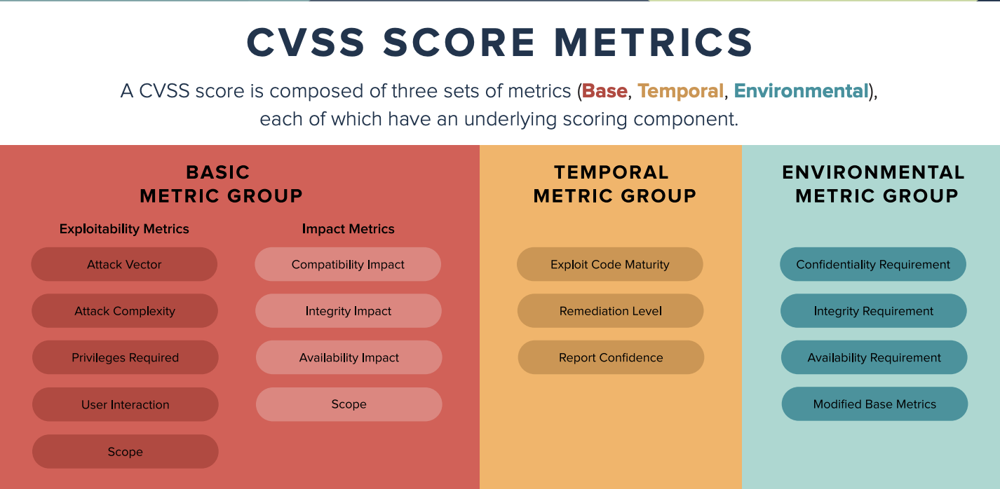
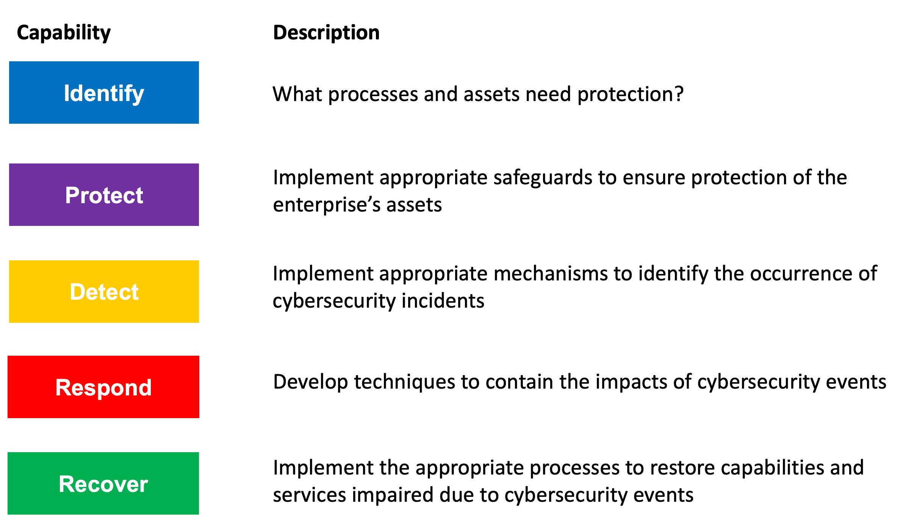
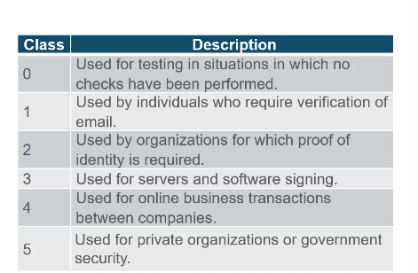

# Chapter 21-23

- Glovebox Glovebox is a user interaction tool that provides a safe environment to dissect malware without the risk of infecting your network.

What are the three outcomes of the NIST Cybersecurity Framework identify core function? (Choose three.)
- governance, risk assessment, asset management

- Digital signatures commonly use digital certificates that are used to verify the identity of the originator in order to authenticate a vendor website and establish an encrypted connection to exchange confidential data. One such example is when a person logs into a financial institution from a web browser.

- 
What is the purpose for using digital signatures for code signing?

- Code signing is used to verify the integrity of executable files downloaded from a vendor website. Code signing uses digital certificates to authenticate and verify the identity of a website.

- In a hierarchical CA topology, CAs can issue certificates to end users and to subordinate CAs, which in turn issue their certificates to end users, other lower level CAs, or both. In this way, a tree of CAs and end users is built in which every CA can issue certificates to lower level CAs and end users. Only the root CA can issue a self-signing certificate in a hierarchical CA topology.

- There are six steps in the vulnerability management life cycle:
1. Discover
2. Prioritize assets
3. Assess
4. Report
5. Remediate
6. Verify

# Cryptography

h = H(x)
-> One way and not reversible

MD5 with 128-bit digest -> One way function that produces a 128 bit hashed message

SHA-1 -> 160 bit

SHA-2, then SHA-256, SHA-384 and SHA-512

-> Hashing is just about integrity, protect against accidental changes

HMAC (Origin authentication and integrity assurance
)
-> use HMAC (an additional secret key as input to the hash function)
-> Only sender and reciever know the secret key
-> If two parties share a secret key and use HMAC functions for authentication, a properly constructed HMAC digest of a message that a party has received indicates that the other party was the originator of the message

Symmetric and Asymmetric

RC4 and R5 -> Stream cipher

Diffie-hellman

Public key to encrypt and Private key to decrypt = Confidentiality

Authentication
Private Key to encrypt + Public key decrypt = Authentication

# Public Key Cryptography
- Using Digital Signatures
-> Code Signing
- Used to verify the integrity of executable files downloaded from a vendor website. It also uses signed digital certs to authenticate and verify the identity of the site that is the source of the files
-> Digital Certificates
These are used to authenticate the identity of a system with a vendor website and establish an encrypted connection to exchange confidential data

DSS algos
- DSA (Digital signature Algo)
- RSA
- ECDSA

CA creates digital certs by typing a public key to a confirmed identify such as a website or individual

There are also registration authority is a subordinate CA and certified by a root CA to issues certificates for specific uses

How much you want to verify (More trusted)

Single-Root PKI

Cross-certified CA

Hierarchical CA

PKI vendors dont matter, which is more trusted
- Internet X.509 public key infra cert policy (RFC 2527)

Only a root CA can issue a self-signed that is recongized

# Endpoint Protection

Signature-based
Heuristics-based -> Signature-based, various characteries of known malware files
General features shared by types of malware
Behaviour-based -> Employs analysis of suspicious behavior

Network-based malwae protection
- AMP
- Email security appliance (ESA)
- Web security appliance (WSA) Provides filtering of websites and blacklisting
- Network admission control (NAC)
Permits only authorised and compliant systems to connect to the network

Host-based firewalls
- Windows defender
- iptables - linux allow configure network access rules
- nftables - linux firewall app that uses a simple vm in linux kernel
- TCP wrappers - rule-based access control and loggin system for linux

HIDS
- Anomaly based
-> Behaviour vs normal behaviour

- Policy based
-> Rules or predefined settings

Examples -> Cisco AMP, snort
- OSSEC manager for HIDS

Cisco Firepower security management

Cuckoo Sandbox, free malware analysis system sandbox

ANY.RUN is an online tool that offers the ability to upload a malware sample for analysis like any online sandbox
