# Chapter 24-26

- Hackers may try to block clients from sending data to the syslog server, manipulate or erase logged data, or manipulate the software used to transmit messages between the clients and the server. Syslog-ng is the next generation of syslog and it contains improvements to prevent some of the exploits.

- The echo ICMP packet should not be allowed inbound on an interface. The echo-reply should be allowed so that when an internal device pings an external device, the reply is allowed to return.

- ICMP traffic from inside the company is also a threat. Some varieties of malware use ICMP packets to transfer files from infected hosts to threat actors via ICMP tunneling.

-  Sguil makes Snort-generated alerts readable and searchable.

- Like session data, statistical data is about network traffic. Statistical data is created through the analysis of other forms of network data.

- Network behavior analysis (NBA) and network behavior anomaly detection (NBAD) are approaches to network security monitoring that use advanced analytical techniques to analyze NetFlow or IPFIX network telemetry data.

- The Network Analysis Module of the Cisco Prime Infrastructure system and Wireshark have GUI interfaces and can display full packet captures. The tcpdump tool is a command-line packet analyzer.

- The HEADER section of the message contains the timestamp. If the timestamp is preceded by the period (.) or asterisk (*) symbols, a problem is indicated with NTP.

- Cisco Web Security Appliance (WSA) devices provide a wide range of functionalities for security monitoring. WSA effectively acts as a web proxy. It logs all inbound and outbound transaction information for HTTP traffic.

- The Cisco Web Security Appliance (WSA) acts as a web proxy for an enterprise network. WSA can provide many types of logs related to web traffic security including ACL decision logs, malware scan logs, and web reputation filtering logs. The Cisco Email Security Appliance (ESA) is a tool to monitor most aspects of email delivery, system functioning, antivirus, antispam operations, and blacklist and whitelist decisions. The Cisco ASA is a firewall appliance. The Cisco Application Visibility and Control (AVC) system combines multiple technologies to recognize, analyze, and control over 1000 applications.

- A retrospective analysis can help in tracking the behavior of the malware from the identification point forward

- OSSEC is a host-based intrusion detection system (HIDS) that is integrated into Security Onion and actively monitors host system operation.

What is the purpose for data reduction as it relates to NSM? Network Security Monitoring (NSM)
- The amount of network traffic that is collected by packet captures and the number of log file entries and alerts that are generated by network and security devices can be enormous. For this reason, it is important to identify the NSM-related data that should be gathered. This process is called data reduction.

- OSSEC is a HIDS integrated into the Security Onion and uses rules to detect changes in host-based parameters like the execution of software processes, changes in user privileges, registry modifications, among many others. OSSEC rules will trigger events that occurred on the host, including indicators that malware may have interacted with the OS kernel. Bro, Snort, and Suricata are examples of NIDS systems.

- Dashboards provide a combination of data and visualizations designed to improve the access of individuals to large amounts of information. Kibana includes the capability of designing custom dashboards. In addition, other tools that are included in Security Onion, such as Squert, provide a visual interface to NSM data.

- The MITRE Framework uses stored information on attacker tactics, techniques, and procedures (TTP) as part of threat defense and attack attribution. This is done by mapping the steps in an attack to a matrix of generalized tactics and describing the techniques that are used in each tactic. These sources of information create models that assist in the ability to attribute a threat.

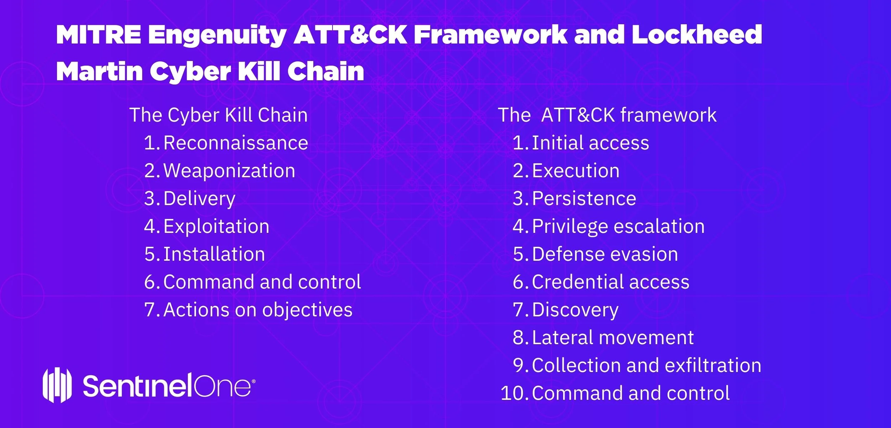

- attacker tactics, techniques, and procedures
- mapping the steps in an attack to a matrix of generalized tactics

- In the installation phase of the Cyber Kill Chain, the threat actor establishes a back door into the system to allow for continued access to the target. Among other measures, using HIPS to alert or block on common installation paths and auditing endpoints to discover abnormal file creations can help block a potential back door creation.

- In the command and control phase of the Cyber Kill Chain, the threat actor establishes command and control (CnC) with the target system. With the two-way communication channel, the threat actor is able to issue commands to the malware software installed on the target.

- The meta-feature element results are used to delineate what the adversary gained from the intrusion event.

- NIST defines four phases in the incident response process life cycle. It is in the containment, eradication, and recovery phase that evidence is gathered to resolve an incident and to help with subsequent investigations.

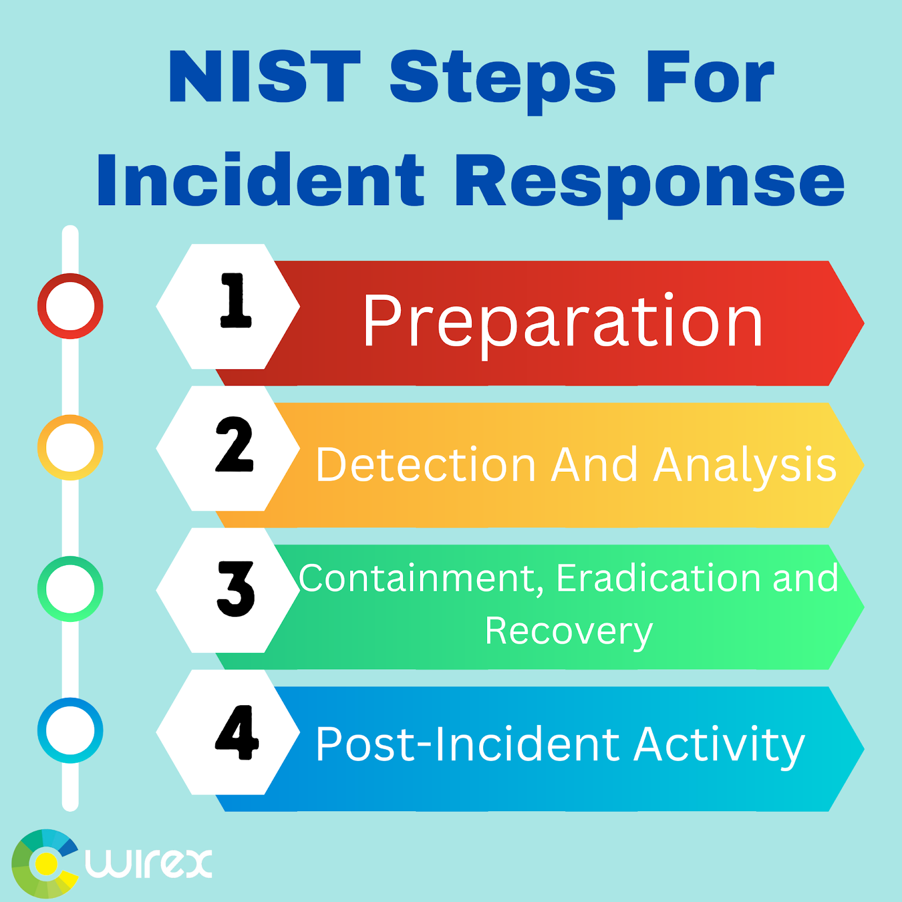

In the detection and analysis phase of the NIST incident response process life cycle, the CSIRT should immediately perform an initial analysis to determine the scope of the incident, such as which networks, systems, or applications are affected; who or what originated the incident; and how the incident is occurring.

- GPL - source fire
- VRT - Rules by cisco talos
- ET - open source rules

# Technologies and Protocols

Syslog typically listen on UDP port 514
- syslog-ng (next generation)

NTP uses UDP port 123

Threat actors have been known to use NTP systems to direct DDoS attacks through vulnerabilities in client or server software

DNS

Cisco Umbrella Passive DNS service can be used to block these requests

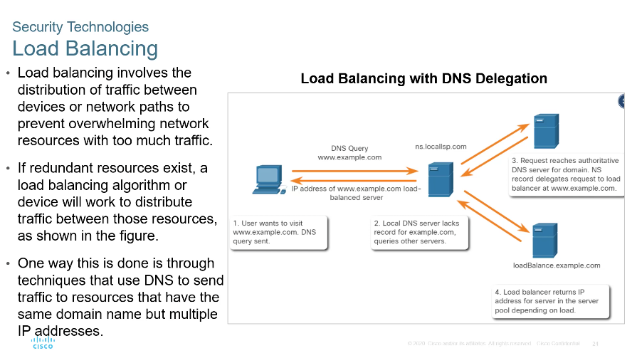

# Network Security Data

Alerts are generated by Snort are made readable and searchable by the Sguil and Squert applications which are part of the security onion suite of NSM (Network security management) tools

5 tuples of source, dest , sourc dest port and ip code

NIDs -> Zeek

Full Packet Captures
-> Most detailed network data that is generally collected

An example of an NSM tool that utilized statistical analysis is Cisco cognitive threat analytics

Host logs
- App logs
- System logs
- Setup logs
- Security Logs
- Command-line logs

Error -> Significant problem such as loss of data or functionality
Warning -> An event is not every significant but may indicate a possible future problem
Informational
Success Audit
Failure Audit

Syslog
PRI (Priority), Header, MSG

Facility

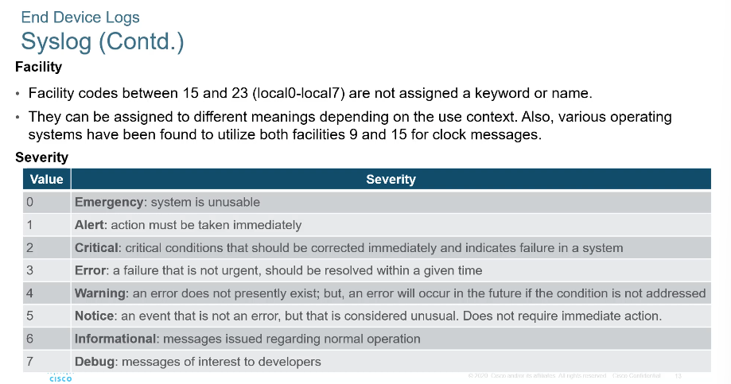

SIEM
Normalisation -> Maps log message from diff system to common data model

Correlation -> Links logs and events from disparate systems or applications, speeding detection of and reaction to security threats

Aggregation -> Reduces the volume of event data by consolidating duplicate event records

Reporting -> Presents the correlated, aggregated event data in real-time monitoring and long term summaries

Compliance -> This is reporting to satisfy the requirements of various compliance regulations

Splunk threat dashboard

Netflow is a protocol by cisco as a tool for network troubleshooting and session-based accounting - can be viewed from nfdump

The Cisco AVC combines multiple technologies to recognised analyse and control over 1000 applications

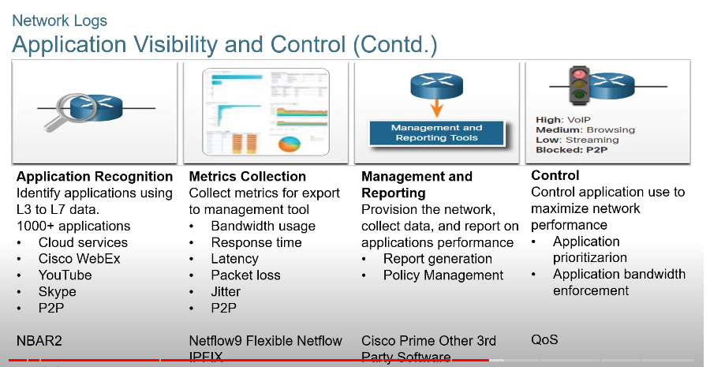

Cisco umbrella formerly opendns, managing dns

# Evaluting Alerts

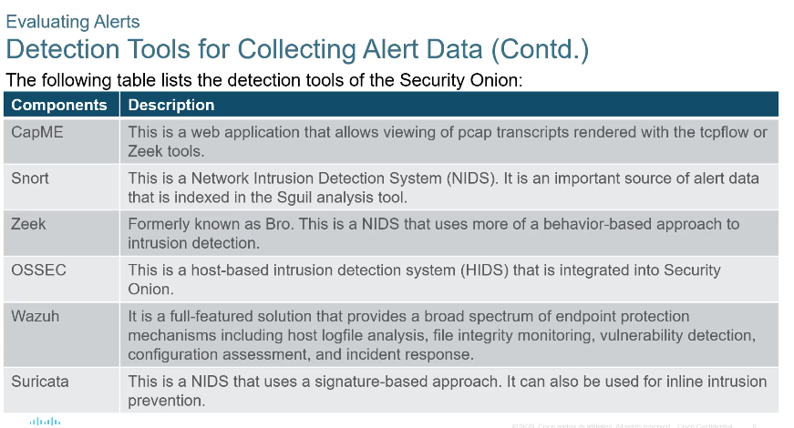

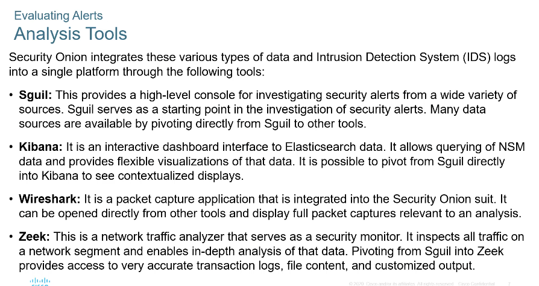

ST -> Status of event
CNT -> Count number of times event has occured
Sensor -> This is the agent reporting the event. The availbale sensors and their identifying numbers can be found in the agent status tab of the pane

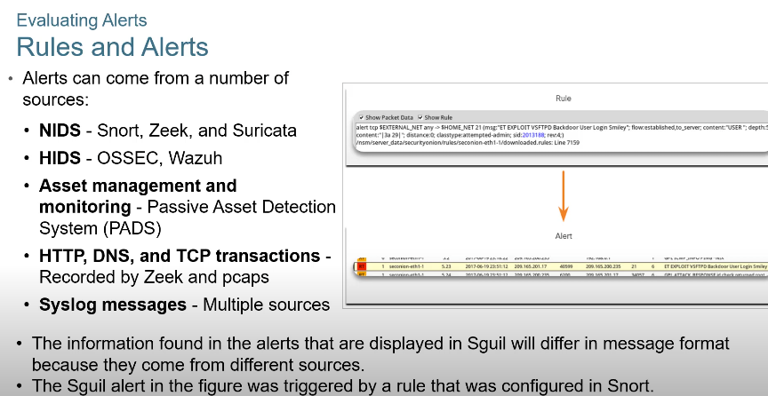

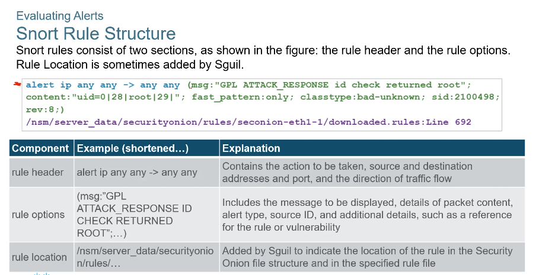

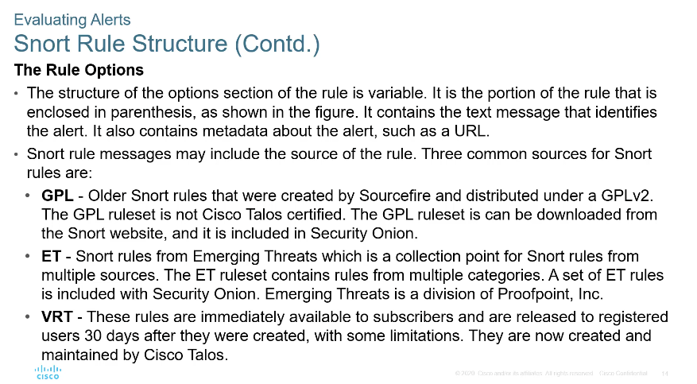

Sources of Snort rules

GPL -> Older snort rules that created by sourcefire and distributed under a GPLv2

ET -> Snort rules from emerging threats which is a collection point for snort rules from mulitple sources. The ET ruleset contains rules from multiple categories. A set of ET rules is included with Security Onion

VRT -> Immediately availble to subscribers and are released to registered users 30 days after they were created with some limitations. They are now created and maintained by cisco talos

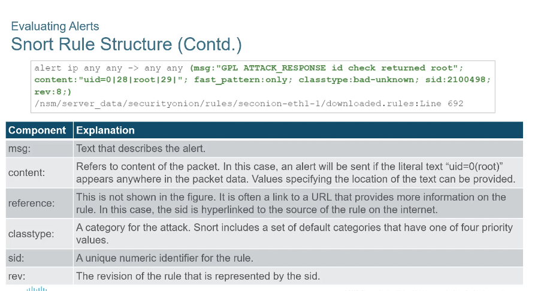

Evaluating alerts
-> Truepositive
-> False positive

Deterministic Analysis (all known)
-> All prior steps in the exploit must also be successful

Probabilistic Analysis
-> Statistical techniques are used to determine the probability that a successful exploit will occur based on the likelihood that each step in the exploit will succeed.