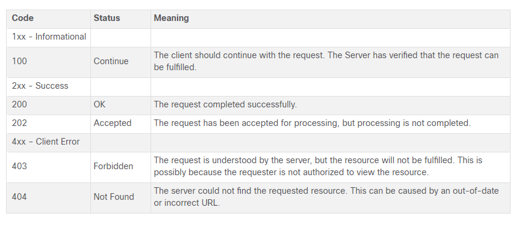

# Chapter 5-10

- When a Windows PC is configured to obtain an IP address automatically, the PC will try to obtain an IP address from a DHCP server. When the PC cannot contact a DHCP server, Windows will automatically assign an address belonging to the 169.254.0.0/16 range.

- When a host or gateway receives a packet that it cannot deliver, it can use an ICMP Destination Unreachable message to notify the source that the destination or service is unreachable. The message will include a code that indicates why the packet could not be delivered. These are some of the Destination Unreachable codes for ICMPv4:

    0 : net unreachable
    1 : host unreachable
    2 : protocol unreachable
    3 : port unreachable

- TFTP uses UDP
- Port numbers 21 and 20 are used for FTP. Port 21 is used to establish the connection between the 2 computers (or hosts) and port 20 to transfer data (via the Data channel).

- 1xx - Informational
- 2xx - Success
- 3xx - Redirection
- 4xx - Client Error
- 5xx - Server Error

# Ethernet and IP protocol

Physical and MAC -> 802.3
LLC -> 802.2

Min and Max of ethernet
64 and max 1518 bytes

Includes all bytes from destination MAC through Frame check sequence

Any frame less than 64 bytes in length is considered a "collision fragment" or "runt frame" and automatically discarded by receiving station. Frames with more than 1500 bytes of data are consider "jumbo" or "baby giant frames"