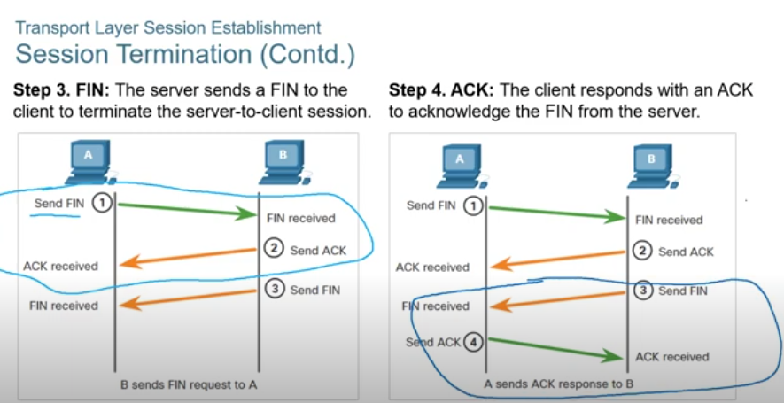
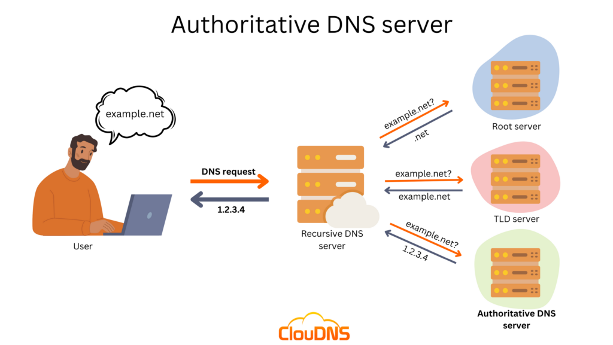
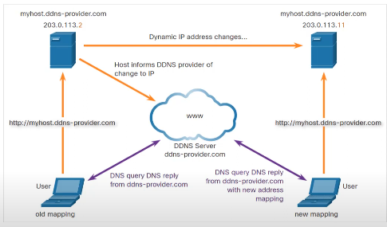

# Chapter 5-10

- When a Windows PC is configured to obtain an IP address automatically, the PC will try to obtain an IP address from a DHCP server. When the PC cannot contact a DHCP server, Windows will automatically assign an address belonging to the 169.254.0.0/16 range.

- When a host or gateway receives a packet that it cannot deliver, it can use an ICMP Destination Unreachable message to notify the source that the destination or service is unreachable. The message will include a code that indicates why the packet could not be delivered. These are some of the Destination Unreachable codes for ICMPv4:

    0 : net unreachable
    1 : host unreachable
    2 : protocol unreachable
    3 : port unreachable

- TFTP uses UDP
- Port numbers 21 and 20 are used for FTP. Port 21 is used to establish the connection between the 2 computers (or hosts) and port 20 to transfer data (via the Data channel).

- 1xx - Informational
- 2xx - Success
- 3xx - Redirection
- 4xx - Client Error
- 5xx - Server Error

# Ethernet and IP protocol

Physical and MAC -> 802.3
LLC -> 802.2

Min and Max of ethernet
64 and max 1518 bytes

Includes all bytes from destination MAC through Frame check sequence

Any frame less than 64 bytes in length is considered a "collision fragment" or "runt frame" and automatically discarded by receiving station. Frames with more than 1500 bytes of data are consider "jumbo" or "baby giant frames"

Start frame delimiter, used for synchronisation between the sending and receiving devices

Mac Add is 48 bit binary -> 12 hexadecimal 

Characteristics of IP
-> Connectionless, there is no connection
-> Best effort 
-> Media independent 

Class A 0.0.0.0/8 to 127.0.0.0/8

Class B 128.0.0.0/16 - 191.255.0.0/16

Class C 192.0.0.0/24 - 223.255.255.0 /24 

Class D 224.0.0.0 to 239.0.0.0 

Class E experimental address block consisting of 240.0.0.0 - 255.0.0.0

Reserved Private Addresses
10.0.0.0/8 or 
172.16.0.0/12
192.168.0.0/16

IPv6 128 bits
32 Hexadecimal values

Rule 1 omit any leading 0s

Rule 2 Double Colon for any single contiguous string of one or more 16 bit hextets consisting of all zeros

64 bits of Prefix length

ICMPv6 RS and RA Messages

- RA messages are sent by routers to provide addressing information to hosts using stateless address auto configuration 

Router Advertisement

A host using SLAAC will set its default gateway to the link-local address of the router that sent the RA

When a host is configured to obtain its addressing information automatically using SLAAC, the host will send an RS message to the router requesting an RA (Router Solicitation) message

Neighbour solitication,
NA messages are sent in response to an NS message and match the target IPv5 in NS, the NA message includes the device's Ethernet MAC address. This is equivalent to ARP reply in IPv4

Duplicate Address Detection
(DAD), when a device is assigned to a global unicast or link-local unicast address, the DAD is performed on the address to ensure that it is unique

To check the uniqueness of an address, the device will send an NS message with its own IPv6 address. If another device on the network has this address, it will respond with an NA message which will notify the sending device that the address is in use. If a corresponding NA message is not returned within a certain period, the unicast address is unique and acceptable for use.

tracert, generates a list of hops that were successfully reached on the path. It lists the interface of every router in the path between the host

Roud trip time -> for each hop

Traceroute has hop limit and time out

0 - echo reply
3 - destination unreacheble
5 - redirect
8 - echo request
11- time exceeded

On cisco router, the show ip arp command is used to display the arp table

On windows 10 pc the arp -a command is used to display the arp table

ARP spoofing and arp poisoning

# Transport Layer

Both TCP and UDP have checksum and sequence number

Session termination

URG - urgent
ACK - Acknowledgement
PSH - push function
RST - reset the connection
SYN - Synchronise sequence numbers
Fin - NO more data from sender and used in session termination

During session setup, an initial sequence number (ISN) is set which is the starting value of bytes that are transmitted to the receiving application
ISN is just a random number

SACK -> selective acknowledgement,

MSS 1460 bytes max, actual is 1500 - 20 -20 from TCP and IP header

I am not getting the acknowledgements i expect, so i will reduce the bytes send before getting an acknowledgement

# Network Services

DHCP operation
DORA
1. Discover
2. Offer
3. Request
4. Ack

DHCP is UDP

DNS

Root level -> Top level domain (.net, .edu, .com etc) -> Second level domain 

Send from lower level servers until higher level. This are recursive queries

Caching DNS servers can resolve recursive queries without forwarding the queries to higher level servers.

Zone transfer, lets say go from .com to .gov. It will request a transfer of that data from an authoritative server for that zone

An Authoritative server provides definitive answers to DNS queries, such as mail server IP address or web site IP address (A resource record). It does not simply return cached responses from another name server, but rather provides answers to queries about domain names that are configured in its system.

UDP port 53

If DNS response exceeds 512 bytes. Dynamic DNS is used (DDNS)

DNS protocol communications use a single format called a message

DNS message format

Question - Question for the server. Contains the domain name to be resolved, the class of domain and the query type.
Answer - for the query including the resolved IP address depending on the RR type
Authority - Contains the Resource Records for domain authority
Addition

DDNS allows a user or organisation to register an IP address with a domain name as in DNS

WHOIS a TCP-based protocl used to identify the owners of internet domains through the DNS system

ICANN lookup, is used to obtain the registration record a url

PORT address translation/NAT overload

Same IP but different port

FTP and TFTP, ftp is port 21

1. Client open connection for control traffic
2. Client data connection, for data

TFTP uses port 69

SMB
port 445, same network on windows

Start authenticate, terminate sessions, control file and printer access

POP3 vs IMAP

Port 110 
POP3 email are downloaded to the client and removed from the server

The server starts the POP3 service by passively listening on TCP port 110 for client connection requests

Once connection is established the POP3 server sends a greeting. The client and POP3 server then exchange commands and responses until the connection is closed or aborted

IMAP
copies of messages are downloaded to the client application. Orignal are kept on the server until manually deleted

What are the other differences between HTTP/2 and HTTP/1.1 that impact performance?
Multiplexing: HTTP/1.1 loads resources one after the other, so if one resource cannot be loaded, it blocks all the other resources behind it. In contrast, HTTP/2 is able to use a single TCP connection to send multiple streams of data at once so that no one resource blocks any other resource. HTTP/2 does this by splitting data into binary-code messages and numbering these messages so that the client knows which stream each binary message belongs to.

Server push: Typically, a server only serves content to a client device if the client asks for it. However, this approach is not always practical for modern webpages, which often involve several dozen separate resources that the client must request. HTTP/2 solves this problem by allowing a server to "push" content to a client before the client asks for it. The server also sends a message letting the client know what pushed content to expect – like if Bob had sent Alice a Table of Contents of his novel before sending the whole thing.

Header compression: Small files load more quickly than large ones. To speed up web performance, both HTTP/1.1 and HTTP/2 compress HTTP messages to make them smaller. However, HTTP/2 uses a more advanced compression method called HPACK that eliminates redundant information in HTTP header packets. This eliminates a few bytes from every HTTP packet. Given the volume of HTTP packets involved in loading even a single webpage, those bytes add up quickly, resulting in faster loading.